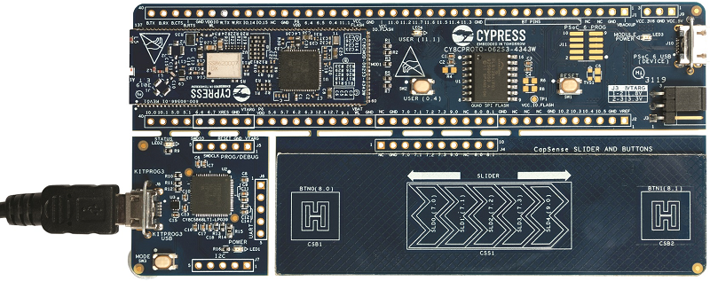

# CY8CPROTO-062S3-4343W BSP

## Overview

The CY8CPROTO-062S3-4343W Kit is a low-cost hardware platform that enables design and debug of the PSoC 62 MCU (CY8C6245LQI-S3D72) and the Murata LBEE5KL1DX Module (CYW4343W WiFi + Bluetooth Combo Chip).

To use code from the BSP, simply include a reference to `cybsp.h`.

## Features

### Kit Features:

* Support of up to 512 KB Flash and 256 KB SRAM
* Dedicated SDHC to interface with WICED wireless devices.
* Delivers dual-cores, with a 150-MHz Arm Cortex-M4 as the primary application processor and a 100-MHz Arm Cortex-M0+ as the secondary processor for low-power operations.
* Supports Full-Speed USB, capacitive-sensing with CapSense.

### Kit Contents:

* CY8CPROTO-062S3-4343W board
* USB Type-A to Micro-B cable
* Quick Start Guide

## BSP Configuration

### Clock Configuration

| Clock    | Source    | Output Frequency |
|----------|-----------|------------------|
| CLK_HF0  | CLK_PATH0 | 100 MHz          |
| CLK_HF2  | CLK_PATH0 | 50 MHz           |
| CLK_HF3  | CLK_PATH1 | 48 MHz           |
| CLK_HF4  | CLK_PATH0 | 100 MHz          |

### Power Configuration

* System Active Power Mode: LP
* System Idle Power Mode: Deep Sleep
* VDDA Voltage: 3300 mV
* VDDD Voltage: 3300 mV

## API Reference Manual

The CY8CPROTO-062S3-4343W Board Support Package provides a set of APIs to configure, initialize and use the board resources.

See the [BSP API Reference Manual][api] for the complete list of the provided interfaces.

## More information
* [CY8CPROTO-062S3-4343W BSP API Reference Manual][api]
* [CY8CPROTO-062S3-4343W Documentation](www.cypress.com/documentation/development-kitsboards)
* [Cypress Semiconductor](http://www.cypress.com)
* [Cypress Semiconductor GitHub](https://github.com/cypresssemiconductorco)
* [ModusToolbox](https://www.cypress.com/products/modustoolbox-software-environment)

[api]: https://cypresssemiconductorco.github.io/TARGET_CY8CPROTO-062S3-4343W/html/modules.html

---
© Cypress Semiconductor Corporation, 2019.